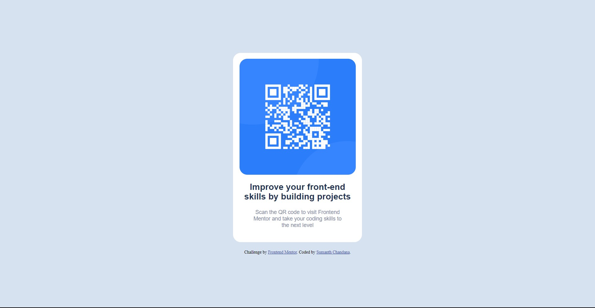

# Frontend Mentor - QR code component solution

This is a solution to the [QR code component challenge on Frontend Mentor](https://www.frontendmentor.io/challenges/qr-code-component-iux_sIO_H). Frontend Mentor challenges help you improve your coding skills by building realistic projects. 

## Overview

### Screenshot

### Links

- Solution URL: [https://github.com/sumanth-chandana/qr-code-component.git](https://github.com/sumanth-chandana/qr-code-component.git)
- Live Site URL: [https://f-m-qrcode-component.netlify.app/](https://f-m-qrcode-component.netlify.app/)

## Author

- Frontend Mentor - [@sumanth-chandana](https://www.frontendmentor.io/profile/sumanth-chandana)

